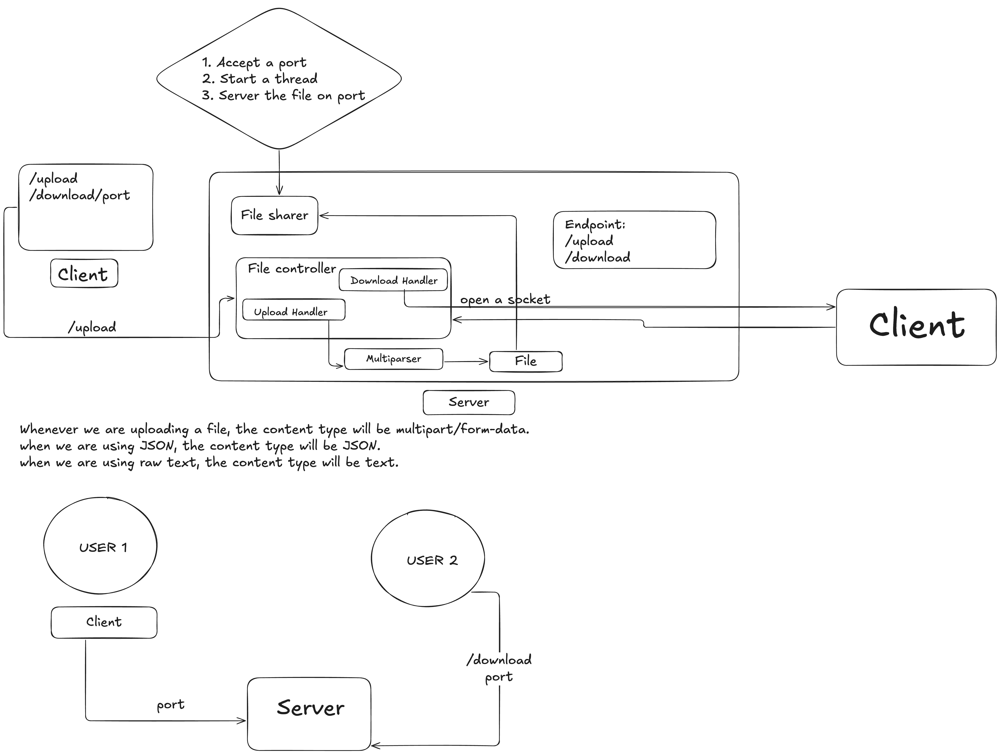

# PeerPass


**PeerPass** is a lightweight peer-to-peer file-sharing platform designed to demonstrate low-level networking concepts. It combines a raw Java socket backend with a modern Next.js frontend to facilitate ephemeral file sharing.

🔗 **Live Demo:** [https://peerpass.vercel.app/](https://peerpass.vercel.app/)

---

## 🚀 How It Works

PeerPass moves away from traditional database storage for file transfers, utilizing direct socket streams and dedicated threads instead.

<p align="center">
  
</p>

1. **Upload:** A user uploads a file via the frontend.
2. **Dynamic Port Assignment:** The Java server receives the stream via `multipart/form-data` and assigns a unique, dynamic download port.
3. **Thread Spawning:** The server spawns a dedicated thread responsible solely for serving that specific file.
4. **Download:** Any user can download the file by connecting to the specific port (e.g., `/download/<port>`), streaming the data over raw sockets.

---

## 🛠 Tech Stack

### Backend (Hosted on Railway)
* **Language:** Java
* **Core Concepts:** Raw Sockets, Input/Output Streams, Multithreading
* **Architecture:** Custom HTTP Parser (No frameworks like Spring or Javalin)

### Frontend (Hosted on Vercel)
* **Framework:** Next.js
* **Styling:** CSS
* **Components:** Custom React hooks for file handling

---

## 📂 Project Structure

```text
/peerpass
├── /server                 # Java Backend
│   ├── Main.java           # Entry point
│   ├── FileController.java # Routes traffic
│   ├── UploadHandler.java  # Handles multipart/form-data
│   ├── DownloadHandler.java# Manages socket streaming
│   ├── FileSharer.java     # Logic for file availability
│   ├── Multiparser.java    # Custom multipart parser
│   └── utils/
│       ├── StreamUtils.java
│       └── HttpUtils.java
│
└── /client                 # Next.js Frontend
    ├── /app
    │   ├── page.tsx        # Main UI
    │   └── globals.css     # Styles
    ├── /components
    │   ├── UploadForm.tsx  # Drag & Drop upload
    │   └── DownloadBox.tsx # Download interface
    ├── /public
    ├── next.config.js
    └── package.json
```

---

## 🔌 API Endpoints

The backend exposes a minimalistic API to handle the handshake between the client and the raw socket server.

### 1. Upload File
Initiates the file transfer and allocates a port.

* **URL:** `/upload`
* **Method:** `POST`
* **Content-Type:** `multipart/form-data`
* **Response:**
```json
{
  "port": 8081
}
```

### 2. Download File
Streams the file content directly from the dedicated thread.

* **URL:** `/download/<port>`
* **Method:** `GET`
* **Description:** Connects to the dynamically assigned port returned by the upload endpoint to stream the file.

---

## 💻 Getting Started Locally

Follow these steps to run PeerPass on your local machine.

### Prerequisites
* **Java:** JDK 17 or higher installed (`java -version`)
* **Maven:** Installed (`mvn -version`)
* **Node.js:** Installed with npm (`node -v`)

### 1. Run the Backend
Build the JAR with Maven and start the web server (main class `p2p.App`).

```bash
# Build (compiles and packages into target/)
mvn clean package

# Start the web/API server on port 8080
java -jar target/p2p-1.0-SNAPSHOT.jar
```

The server runs on port 8080. Press Enter in the console to stop it.

### 2. Run the Frontend
Open a new terminal, navigate to the `ui` directory, install dependencies, and start the Next.js dev server.

```bash
cd ui
# Install dependencies
npm install

# Start the development server
npm run dev
```

### 3. Usage
1. Open your browser and go to `http://localhost:3000`.
2. Upload a file via the UI.
3. Use the generated link/port to download the file in a separate tab or browser.

> **Note:** The web UI transfers files through the backend server (a relay). For a
> genuine peer-to-peer transfer where bytes flow directly between two machines, use
> the CLI below.

---

## 🤝 Peer-to-Peer CLI (Direct Transfer)

The same JAR can run as a **sender** or **receiver** peer. In this mode the file
bytes stream **directly socket-to-socket** between the two peers — no server in the
data path. Each sender dynamically allocates an ephemeral port (49152–65535) and
serves connecting peers on their own thread, exchanging a small text handshake
(`PEERPASS/1.0 HELLO` → `OK` + `Filename`/`Length`) before streaming in 1 MB chunks.

**Sender** — offer a file and wait for peers:
```bash
java -jar target/p2p-1.0-SNAPSHOT.jar send ./myfile.pdf
# → Serving 'myfile.pdf' on port 53279
#   Peers can fetch it with:  receive 192.168.1.5:53279
```

**Receiver** — connect directly and download:
```bash
java -jar target/p2p-1.0-SNAPSHOT.jar receive 192.168.1.5:53279 ./downloads
```

The receiver verifies the byte count against the advertised `Length` and fails on a
short read.

**Reachability:** Direct connections work out of the box on the **same LAN**. Across
the internet the receiver must be able to reach the sender's `host:port`
(port-forwarding). Automatic NAT traversal (STUN/TURN) is not implemented.

---

## 🛡 Disclaimer

This project uses raw sockets and custom HTTP parsing for educational purposes to demonstrate multithreading and networking. It handles file streams directly in memory/threads and is not intended for production storage.

---

## 📄 License

MIT
